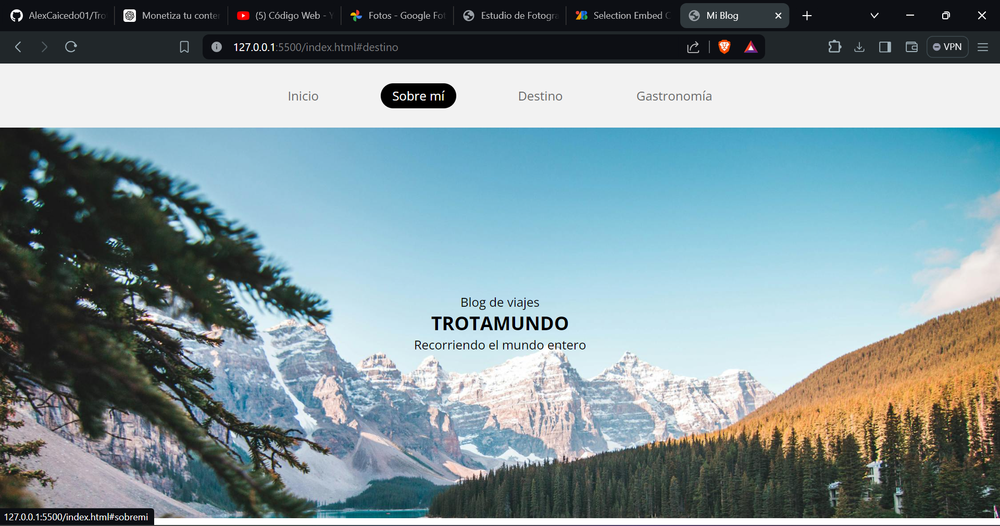

# Mi Blog

¡Bienvenido a mi blog de viajes!

## Contenidos

- [Inicio](#inicio)
- [Sobre Mí](#sobremi)
- [Destino](#destino)
- [Gastronomía](#gastronomia)

## Inicio

Blog de viajes

Recorriendo el mundo entero

## Sobre Mí

Aquí puedes compartir información sobre ti y tu experiencia como viajero.

## Destino

Describe tus destinos favoritos o los lugares que has visitado recientemente.

## Gastronomía

Comparte tus experiencias culinarias durante tus viajes.

## Tecnologias usadas

- <a href="https://developer.mozilla.org/en-US/docs/Web/HTML"> HTML</a>
- <a href="https://developer.mozilla.org/en-US/docs/Web/CSS"> CSS</a>

